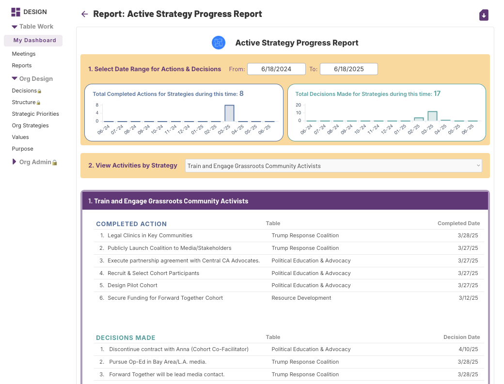

# Adaptation & Celebration: Using Your Own Data

Image credit: [Nick Rush](https://www.pexels.com/photo/group-of-swimmers-celebrating-11211136/)

The beauty of using a single, integrative system to capture and activate strategy organization-wide is the data you then have at your fingertips about your progress. Without any additional entry of data, you can see how each Group is doing as well as how each Strategy and Priority are being activated.&#x20;

## Broadcasting Group Work

As we have outlined in the previous sections, a variety of expressions of strategy and priority activation are being captured in the course of every Group’s work.

Conveners and Sponsors use reporting to see how clearly they are capturing and broadcasting their planned and completed strategy activation work. These data tell a very rich story. This story allows us to continue deepening our shared understanding of what our strategies mean and what they require. They allow us to celebrate wins and course correct where we must.

&#x20;Let’s review here in one place which data points are captured and what they express.

<table><thead><tr><th width="236.05078125">Broadcast Item</th><th>Strategy Expression</th></tr></thead><tbody><tr><td><ol><li><strong>Meeting Name</strong></li></ol></td><td>Where Group attention is focused</td></tr><tr><td><ol start="2"><li><strong>Action - Planned</strong></li></ol></td><td>What Group plans to do to activate strategy</td></tr><tr><td><ol start="3"><li><strong>Action - Completed</strong></li></ol></td><td>What Group has done to activate strategy</td></tr><tr><td><ol start="4"><li><strong>Decision - Proposal</strong></li></ol></td><td>A group decision to do or not do something that is carefully articulated and waiting to be made by consent or consensus in the Group Voting space</td></tr><tr><td><ol start="5"><li><strong>Decision - Made</strong></li></ol></td><td>A decision to do or not do something that the Group has made, whether in real time or through the group voting process</td></tr></tbody></table>

All of the data above across all Teams/Tables gives leadership an invaluable look at strategy activation any time, in real time.

### Example: Executive Team Meeting with Organization Rollup Report

The Executive Team uses the Organization Rollup Report to facilitate discussion of Group strategy activation. Each Sponsor uses the data to report out on their Group progress and facilitate discussion with fellow leaders.

In the partial screenshot of this report below, you see the data presented for each Group: last 5 Decisions made, top three Actions planned, the Meeting Names and dates of their three most recent meetings, and lastly, the next Meeting Name and date they have scheduled.

<figure><figcaption>
Screenshot of JOD Organization Rollup Report
</figcaption></figure>

### Example: Executive Team Meeting with Strategy Progress Report

Whereas the previous example and report looks at progress by Group, in this example we see progress by Strategy. The Executive Team uses the Strategy Progress Report to facilitate discussion of the organization-wide activation of each strategy.

In the partial screenshot of this report below, you see the data presented for each Strategy: completed Actions with the Group name and date of completion and Decisions made with the Group name and date of the decision.

This report is also extremely useful in preparing for board meetings. To keep boards focused at the strategy level, leadership can select key progress stories from this report: recent, specific examples of how the staff is activating a given strategy. You set your desired data range for the review and discussion, e.g. one month, one quarter, etc.

<figure><figcaption>
Screenshot of JOD Strategy Progress Report
</figcaption></figure>

### Example: Sponsor-Conveners Meeting with Group Plans Report

As we have emphasized through this guide, the role of Sponsors and Conveners are essential to the successful implementation of Justorg Design and to strategic alignment across an organization.

In preparing for and having a check-in meeting with Group Conveners, the Sponsor reviews the Group Plans Report. They use the data together in their check-in meetings to be sure the Conveners are moving the body of work in the optimal direction.

In the partial screenshot of this report below, you see the data presented for each Group: active Action sorted by Strategy and planned Meeting Names and dates. This is a snapshot of where the Group is focused and what its current plans are. The Sponsor can guide and, where necessary, course correct.

<figure><figcaption>
Screenshot of JOD Team/Table Plans (Roadmap) Report
</figcaption></figure>

\
