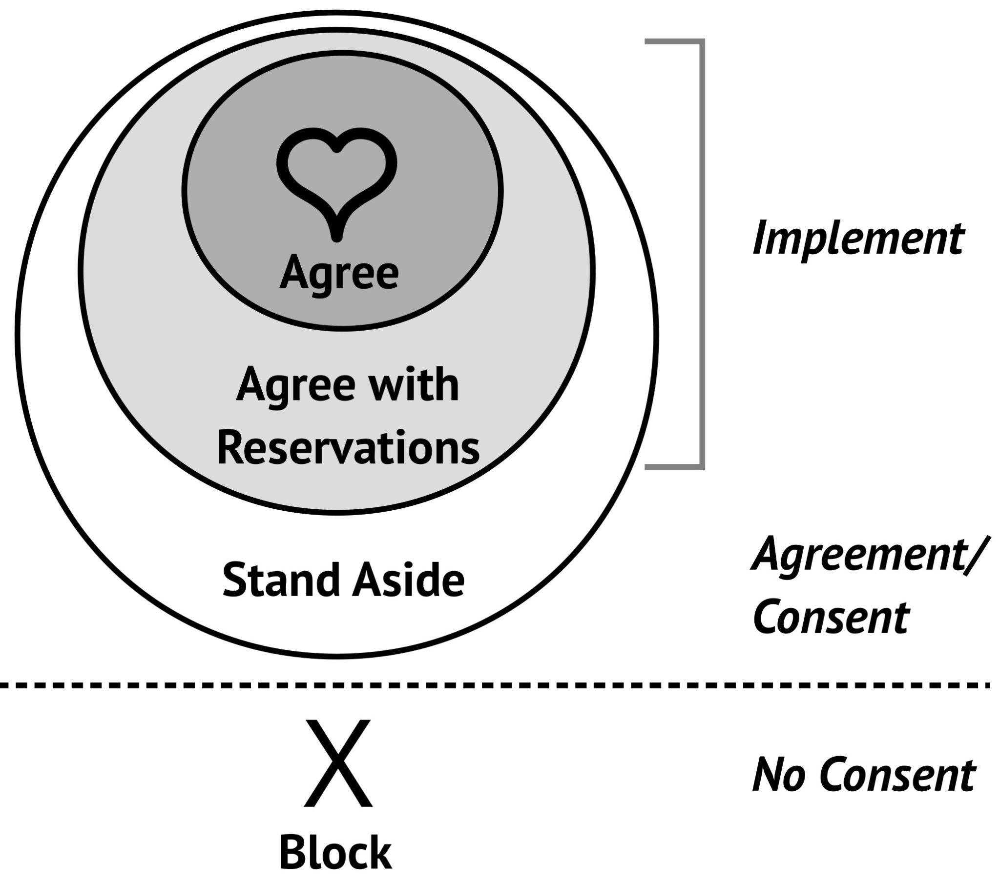

# Decision-Making (DTBMs)

Image credit: [Pixabay on pexels](https://www.pexels.com/photo/architecture-black-and-white-challenge-chance-277593/)

## **What do we mean?**

By decision making, we mean the strategic choices a Table makes in order to more fully activate one or more organizational strategies. We do not mean every decision made by every staff person in the course of their daily work, but rather the decisions identified and made by a Table to advance strategies.

In JustOrg Design, we very intentionally use the term decision-to-be-made or DTBM. The “to-be-made” language reminds us to pause. To take our time in articulating the actual choice in front of us and how it could advance one or more organizational strategies. This pause significantly increases our chances for clarity, strategic alignment, and equity.

Indications that a decision is associated with advancing strategy and thus appropriate for a Table to work on collectively:

* [ ] The decision will significantly change how we design and deliver key aspects of our work
* [ ] The decision will affect multiple functions/departments of the organization
* [ ] The decision will involve discontinuing a current practice or program
* [ ] The decision will involve adding a new practice or program
* [ ] The decision will involve adding or changing the nature of a key organizational partnership or funding relationship
* [ ] The decision will significantly affect our employee culture and/or quality of employment experience

Not all of these things will be present in a single DTBM; these are _potential indications_ that a decision should be treated as a DTBM.

## **Why is it important?**

Decisions are strategies activated. Strategies are mere words until they are expressed through choices. The choice to design a program this way, not that way. To engage this partner, not that one. Decisions are literally how we create change and impact in the world around us.

Decision-making is also the source of enormous amounts of spoken and unspoken conflict in justice organizations. JustOrg Design supports us in getting conscious and serious in our attempt to build our collective decision-making capacity. To build our confidence. To build trust in ourselves and in one another that we can apply strategic thinking to the most important decisions in front of us.

## **How does it work in the JustOrg Design application?**

DTBMs are created at the Table level on the Table Details screen. Only Table Conveners can add or edit DTBMs. All other Table Members are read-only with respect to DTBMs.

When a Table agrees that it is naming a strategic DTBM, the Convener will go to the Add DTBM button on the Table Details screen. Here they enter a number of aspects of the DTBM, including:

* [ ] A short name for the DTBM for easy reference
* [ ] A longer description of the DTBM
* [ ] The strategy(s) that the decision will activate
* [ ] The target date by which the Table will make the decision


**Important Note:** The Executive Leadership Table is authorized to create DTBMs for other Tables. In this case, the assigned DTBM will show up on the assigned Table’s list of active DTBMs. The DTBM’s Status will be Assigned. The Table Convener will discuss it with the whole Table to confirm understanding and acceptance of the assigned DTBM. Assuming the Table is clear and feels prepared to move forward, the Convener will change the DTBM Status from Assigned to Accepted. If for some reason the Table is unclear or resistant to the DTBM, the Convener will connect with the Sponsor to share reasoning and change the Status to either Clarify or Decline. The rest of this section assumes the DTBM is in Accepted Status.


Then throughout the Table’s deliberation on the DTBM, which could be over several Table Meetings, the Convener can add additional details about the DTBM on the Table Specific Decision Details Screen, including:

* [ ] Who will make the decision (typically the whole Table, but occasionally a Table Member individually)
* [ ] The decision-making method (typically consensus, but occasionally advice to a Table Member individually, or another method)
* [ ] Other impacted Tables, where you can note other Tables that will be impacted by this decision
* [ ] Ongoing decision-related deliberation notes

When the DTBM is in fact made, the Convener changes its status to Closed. At this point, the Close DTBM screen pops up and the Convener responds to the following prompts:

* [ ] Summary of the decision?
* [ ] Which values, if any, were most activated by the outcome of this decision?
* [ ] Which strategies were most activated by the outcome of this decision?
* [ ] Any additional takeaways that should be stored with this closed decision?

## **What practices do we recommend?**

The JustOrg Design system allows you to choose from four different decision-making methods: consensus, modified consensus, majority, or advice to an individual Table member. For most Table strategic decisions, we recommend consensus.

We love this [guidance for consensus from Seeds for Change](https://www.seedsforchange.org.uk/consensus#agreement):

“There are many different reasons why someone might not agree with a proposal. Consensus decision-making recognizes this – it's not trying to achieve unanimity but looks for a solution that everyone involved is OK with. Not all types of disagreement stop a group from reaching consensus. Think about it as a spectrum from completely agreeing to completely objecting to a proposal.

* [ ] **Agreement:** “I support the proposal and am willing to implement it.”
* [ ] **Reservations:** “I still have some problems with the proposal, but I’ll go along with it.”
* [ ] **Standing Aside:** “I can’t support this proposal because... but I don’t want to stop the group, so I’ll let the decision happen without me and I won’t be part of implementing it.”
* [ ] **Blocking:** “I have a fundamental disagreement with the core of the proposal that has not been resolved. We need to look for a new proposal.“\

### Further definition from the Seeds for Change website

The words used to describe the different types of agreement and disagreement vary from group to group. It's important to be clear in your group what options you are using and what they mean.

Here are some common options:

#### **Agreement**

“I support the proposal and am willing to implement it.”

#### **Reservations**

“I still have some problems with the proposal, but I’ll go along with it.”

You are willing to let the proposal pass but want to register your concerns. You may even put energy into implementing the idea once your dissent has been acknowledged. If there are significant reservations the group may amend or reword the proposal.

#### **Standing aside**

“I can’t support this proposal because... but I don’t want to stop the group, so I’ll let the decision happen without me and I won’t be part of implementing it.”

You might stand aside because you disagree with with the proposal: “I’m unhappy enough with this decision not to put any effort into making it a reality.”

Or you might stand aside for pragmatic reasons, e.g. you like the decision but are unable to support it because of time restraints or personal energy levels. “I’m OK with the decision, but I’m not going to be around next week to make it happen.”

The group may be happy to accept the stand aside and go ahead. Or the group might decide to work on a new proposal, especially where there are several stand asides.

#### **Blocking**

“I have a fundamental disagreement with the core of the proposal that has not been resolved. We need to look for a new proposal.“

A block stops a proposal from being agreed. It expresses a fundamental objection. It means that you cannot live with the proposal. This isn’t an _“_I don’t really like it” or _“_I liked the other idea better.” It means “I fundamentally object to this proposal!” Some groups say that a block should only be used if your objection is so strong that you’d leave it the proposal went ahead. The group can either look for amendments to overcome the objection or return to the discussion stage to look for a new proposal.

[Source: Seeds For Change](https://www.seedsforchange.org.uk/consensus#agreement)


See our [Resources section](resources.md#decision-making-resources) for more on decision-making methods.&#x20;


