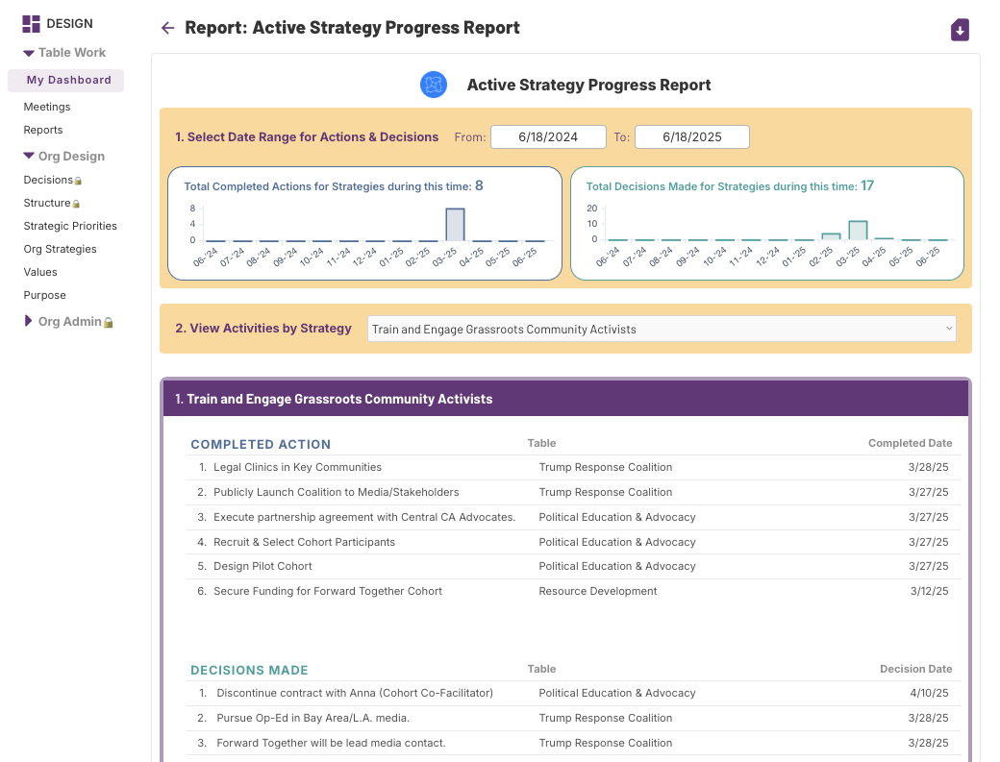

# Defining Organizational Design

For most leaders, the term "organizational design" conjures images of organizational charts, titles, and supervision or reporting lines. It sounds like traditional human resources work. At JustOrg Design, we mean something very, very different by the term.

We define organizational design as: _**the intentional and ongoing co-activation of organizational strategy, structure, and decision-making.**_

<mark style="color:red;">**INSERT OUR ROUND GRAPHIC HERE**</mark>

Organizational design, as we are using the term, is strategic leadership work. It cannot be captured in a chart or a powerpoint deck. It is an active and ongoing set of choices that leadership makes to ensure everyone is engaged in the most important work the organization can be doing in its movement or field right now.&#x20;

The vast majority of justice-committed leaders have replicated or inherited the organizational  structure below.

<figure><figcaption>
TRADITIONAL, VERTICAL NONPROFIT STRUCTURE
</figcaption></figure>

A central problem for justice-committed organizations with this vertical design is that justice strategies are inherently interdisciplinary and experimental, or what in organizational design is called, “horizontal.” Such strategies require collaboration across roles, program areas, power levels, lived expertise, etc.&#x20;

And additional problem is that people working in justice-committed organizations want to practice internally the kinds of changes they seek for the world externally. There is a desire for a conscious holding of power, for transparency, for meaningful engagement of people internally and externally who are closest to the issues and most impacted by organizational choices.

The bottom line, we believe, is that an organizational design that consists only of functional hierarchies will not yield ongoing strategic innovation, alignment, and momentum in a justice-focused context.

