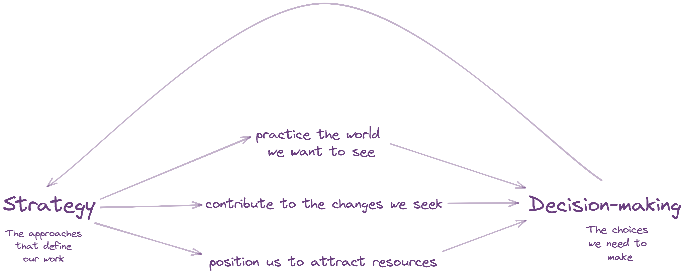

# Table Meeting Design

**What do we mean?**

By **Table Meeting Design**, we mean the intentional creation of an agenda that is distributed prior to a Table Meeting and intended to engage Table members in a strategic conversation. When we design an agenda, we consider four things: meeting objectives, meeting attendees, meeting topics, and meeting engagement techniques.

1. **What is the purpose, or objective, of this particular Table Meeting?**

For instance, do we want to explore a topic? Do we want to generate specific options for action? Do we want to come to a decision?

_Example:_ The objective of this Table Meeting is to explore possibilities for expanding our approach to healing for impacted community members.

_Example:_ The objective of this Table Meeting is to come to a decision on whether to partner with the XYZ Justice Group on our 2023 Advocacy Days.\

1. **Who will attend the Table Meeting?**\
   Will all Table Members be in attendance? Do we want to include anyone beyond the Table Members for this particular conversation? This could be other staff, community members, or board members. This is not necessary, but depending on the strategic conversation you want to have, may enrich the discussion.
2. **What topics will we cover in the Table Meeting?**

You’ll want to break the conversation into clear topics that build toward accomplishing the Table Meeting’s objective(s). For instance, you might start with an agenda review and check-in question to get the group warmed up. You might next go to one Table Member providing a brief history of what the organization has done historically on the topic being explored. Then you might have a round of clarifying questions. Then you might have a full group discussion of options for where the organization could go next. Finally, you might close the meeting with a check-out question to offer everyone a chance to make the connection between the conversation you just had and their own work ahead. Each of these items is an agenda topic; they all build toward a deep group experience of exploring options to activate a strategy.

1. **What engagement techniques will we use to ensure all voices are heard at the Table Meeting?**\
   For instance, is there any preparation we want attendees to do in advance so that people feel better prepared? What facilitation techniques will we incorporate in the agenda design so that everyone gets involved and is supported to share their views?

_Example:_ This Table Meeting will begin with a check-in question related to the meeting topic; each person will have 1 minute to check in.

_Example:_ This Table Meeting will include paired break-outs before the full group discussion so that everyone has 15 minutes to think with someone else before suggesting options for action to the full group.

**Why is it important?**

**Table Meeting Design** is absolutely essential to the quality of strategic conversations at Tables, and thus to organizational strategic alignment. People need time in advance to prepare for complex conversations about strategy. People also need support to bring their voices to the conversation, especially people who may be less experienced in strategic discussions or who have less positional power in the organization. Intentional meeting design is an offering from the Co-Conveners—a proactive guide to how to show up with purpose to the conversation.

**How does it work in the JustOrg Design application?**

When a Convener clicks to add an Agenda, they are brought to the Agenda screen. It has a number of features that support the design of strategy-focused Table Meetings, including:

1. **Attendees:** All Table Members are automatically listed as attendees; simply remove anyone who cannot attend. If you want to add staff who are not Table members simply click in the Staff field and scroll to their name. There are also fields to add board members, community members, and a general other field if you ever want to include non-staff members in a Table Meeting.
2. **Meeting Purpose or Objectives:** There is a dedicated field to capture the high-level intentions of the meeting; that is, what you want to accomplish whether that is exploration, decision-making, etc.
3. **Meeting Topics:** There is a section for adding meeting topics one by one, including their length of time. You’ll notice a helpful meeting duration tracker in the upper right of this section; it auto tabulates the length of the meeting as you add and edit topics. There is also a sorting feature in the bottom left of this section if you decide you want to keep topics you have entered but move them around.
4. **Related Strategies & Decisions-to-be-Made:** Below the meeting topics section, you will find a section for adding the organizational strategy(s) relevant to this particular meeting. This is to continuously keep strategy at the center of the conversation. And to the right, you can add as reference any decisions-to-be-made that the Table has open if they will be discussed in this particular meeting. Again, these two fields are meant to keep everyone focused on strategy and decision-making.

**What practices do we recommend?**

| **LOTS OF THIS**                                                           | **LITTLE TO NONE OF THIS**                                  |
| -------------------------------------------------------------------------- | ----------------------------------------------------------- |
| Agendas distributed 2 days or more in advance                              | Last minute agendas                                         |
| Intentional techniques for engaging Table Members built into agenda topics | Meeting topics without mention of engagement techniques     |
| Linking meetings agendas to one or more organizational strategies          | Meeting agendas not clearly tied to organizational strategy |
